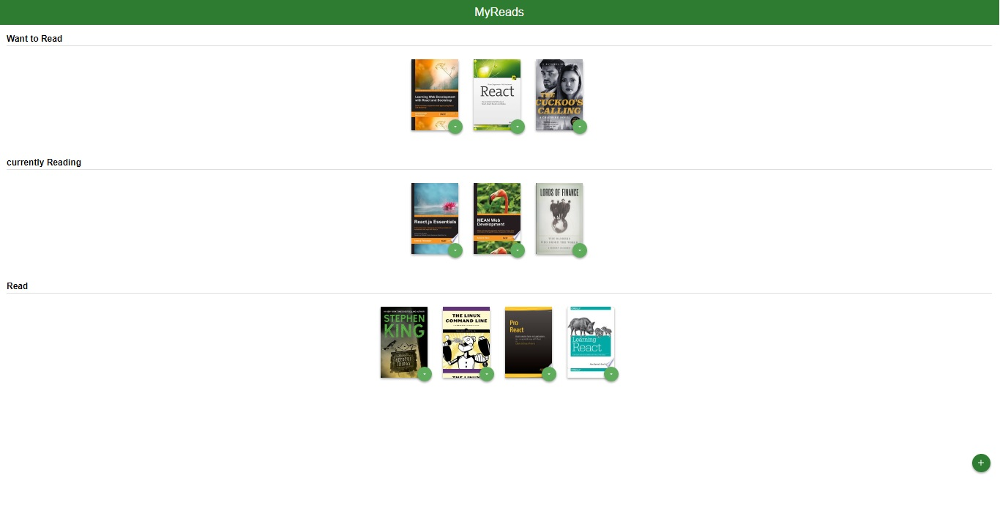
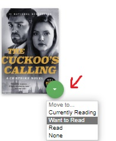
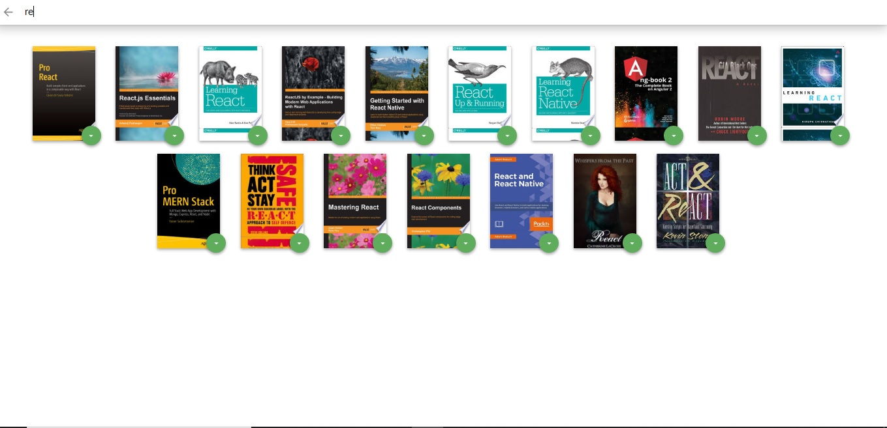
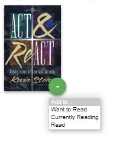

# MyReads Project

This project was built for Udacity Nanodegree Program to learn basic features of React, you can get the starter code from here => [Create React App](https://reactjs.org/docs/create-a-new-react-app.html)

## How to Load the App

You can run this project locally, but check first that you already install Node.js, if you don't have it you can install from here [Node.js](https://nodejs.org/en/)

If you ready, navigate to the directory where you want to store the app and then run this code in your terminal

```
git clone https://github.com/asmaaEbeed/MyReads-React-App.git
```

Then install all dependecies by run this command

```
npm install
```

Now you ready to start project

```
npm start
```


To get started developing right away:

- install all project dependencies with `npm install`
- start the development server with `npm start`

New window will open in your default browser automatically if not you can open this URL [http://localhost:3000/](http://localhost:3000/) in your browser.

- here is home page view



## Project functionality

- Books are sorted into three categories: Currently Reading, Want to Read and Read
- There is arrow button at each book you can open menu and change the book shelf from it, and the current shelf is highlighted to indicate the shelf.


- By clicking on book photo you can go to book details page 


- You can enter search page by click on green button at bottom of page
- Then you redirect to search page.
- Search page include field that you can type book name that you need to search.
- Books will view automatically as here


- Each book that appear in search page will have submenu if book is already in shelf this menu will appear with highlighted the book shelf.


- If book isn't in your shelf this menu will appear to put this book to shelf.



- To add new books, click on the green + button at the bottom of the page.
  Enter an author's name or subject. Up to 20 items will be returned.


## What You're Getting

```bash
├── CONTRIBUTING.md
├── README.md - This file.
├── SEARCH_TERMS.md # The whitelisted short collection of available search terms for you to use with your app.
├── package.json # npm package manager file. It's unlikely that you'll need to modify this.
├── public
│   ├── favicon.ico # React Icon, You may change if you wish.
│   └── index.html # DO NOT MODIFY
└── src
    ├── App.css # Styles for your app. Feel free to customize this as you desire.
    ├── App.js # This is the root of your app. Contains static HTML right now.
    ├── App.test.js # Used for testing. Provided with Create React App. Testing is encouraged, but not required.
    ├── BooksAPI.js # A JavaScript API for the provided Udacity backend. Instructions for the methods are below.
    ├── icons # Helpful images for your app. Use at your discretion.
    │   ├── add.svg
    │   ├── arrow-back.svg
    │   └── arrow-drop-down.svg
    ├── index.css # Global styles. You probably won't need to change anything here.
    └── index.js # You should not need to modify this file. It is used for DOM rendering only.
```

Remember that good React design practice is to create new JS files for each component and use import/require statements to include them where they are needed.

## Backend Server

To simplify your development process, we've provided a backend server for you to develop against. The provided file [`BooksAPI.js`](src/BooksAPI.js) contains the methods you will need to perform necessary operations on the backend:

- [`getAll`](#getall)
- [`update`](#update)
- [`search`](#search)

### `getAll`

Method Signature:

```js
getAll();
```

- Returns a Promise which resolves to a JSON object containing a collection of book objects.
- This collection represents the books currently in the bookshelves in your app.

### `update`

Method Signature:

```js
update(book, shelf);
```

- book: `<Object>` containing at minimum an `id` attribute
- shelf: `<String>` contains one of ["wantToRead", "currentlyReading", "read"]
- Returns a Promise which resolves to a JSON object containing the response data of the POST request

### `search`

Method Signature:

```js
search(query);
```

- query: `<String>`
- Returns a Promise which resolves to a JSON object containing a collection of a maximum of 20 book objects.
- These books do not know which shelf they are on. They are raw results only. You'll need to make sure that books have the correct state while on the search page.

## Important

The backend API uses a fixed set of cached search results and is limited to a particular set of search terms, which can be found in [SEARCH_TERMS.md](SEARCH_TERMS.md). That list of terms are the _only_ terms that will work with the backend, so don't be surprised if your searches for Basket Weaving or Bubble Wrap don't come back with any results.

## Create React App

This project was bootstrapped with [Create React App](https://github.com/facebook/create-react-app). You can find more information on how to perform common tasks [here](https://github.com/facebook/create-react-app/blob/main/packages/cra-template/template/README.md).

## Contributing

This repository is the starter code for _all_ Udacity students. Therefore, we most likely will not accept pull requests.

For details, check out [CONTRIBUTING.md](CONTRIBUTING.md).
